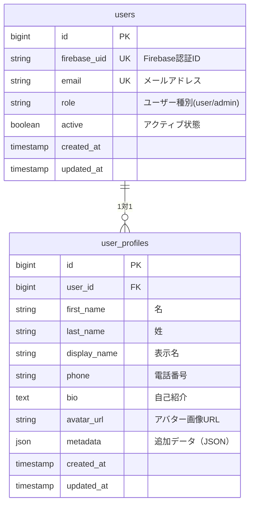

# データベース設計

## 📋 概要

Rails Next Templateアプリケーションのデータベース設計を定義します。
Firebase認証と連携した基本的なユーザー管理機能のみを実装し、
どのような用途にも応用できる汎用的なテンプレートとして設計します。

## 🗃️ ER図



## 📊 テーブル設計

### users テーブル
Firebase認証と連携するユーザー情報を管理

| カラム名 | 型 | 制約 | 説明 |
|---------|-----|------|------|
| id | bigint | PK, AUTO_INCREMENT | ユーザーID |
| firebase_uid | string | NOT NULL, UNIQUE | Firebase認証ID |
| email | string | NOT NULL, UNIQUE | メールアドレス |
| role | string | NOT NULL, DEFAULT 'user' | ユーザー種別 |
| active | boolean | NOT NULL, DEFAULT true | アクティブ状態 |
| created_at | timestamp | NOT NULL | 作成日時 |
| updated_at | timestamp | NOT NULL | 更新日時 |

**インデックス:**
- `index_users_on_firebase_uid` (UNIQUE)
- `index_users_on_email` (UNIQUE)
- `index_users_on_role`

### user_profiles テーブル
ユーザーの詳細プロフィール情報

| カラム名 | 型 | 制約 | 説明 |
|---------|-----|------|------|
| id | bigint | PK, AUTO_INCREMENT | プロフィールID |
| user_id | bigint | NOT NULL, FK | ユーザーID |
| first_name | string | | 名 |
| last_name | string | | 姓 |
| display_name | string | | 表示名 |
| phone | string | | 電話番号 |
| bio | text | | 自己紹介 |
| avatar_url | string | | アバター画像URL |
| metadata | json | | 追加データ（JSON） |
| created_at | timestamp | NOT NULL | 作成日時 |
| updated_at | timestamp | NOT NULL | 更新日時 |

**インデックス:**
- `index_user_profiles_on_user_id` (UNIQUE)

## 🔑 外部キー制約

```sql
-- user_profiles
ALTER TABLE user_profiles 
ADD CONSTRAINT fk_user_profiles_user_id 
FOREIGN KEY (user_id) REFERENCES users(id) ON DELETE CASCADE;
```

## 📝 設計方針

### 1. Firebase認証連携
- `users.firebase_uid`でFirebase認証と連携
- メール認証、ソーシャルログイン対応
- JWT token検証によるAPI認証

### 2. 最小限・汎用性重視
- **User**: Firebase認証との連携
- **UserProfile**: 詳細プロフィール情報
- どのような用途にも応用可能

### 3. 拡張性
- `user_profiles.metadata`: JSON形式で追加属性を保存
- 将来的な機能追加に対応
- 新しいモデルを自由に追加可能

### 4. 論理削除
- `users.active`: 論理削除フラグ
- `user_profiles`: CASCADE削除（ユーザーと一緒に削除）

## 🔄 マイグレーション順序

1. `users`
2. `user_profiles`

## 📈 パフォーマンス考慮

### インデックス戦略
- Firebase UID検索の高速化
- Email検索の最適化
- Role別検索の対応

### クエリ最適化
- N+1問題対策（includes使用）
- 適切なeager loading

## 🎯 用途例

### どんなアプリにも対応
- **ブログ**: 記事テーブルを追加
- **EC**: 商品・注文テーブルを追加
- **SNS**: 投稿・フォローテーブルを追加
- **管理システム**: 各種マスタテーブルを追加

## 🚀 拡張例

### ブログ機能追加
```sql
CREATE TABLE posts (
  id, user_id, title, content, published_at, ...
);
```

### ECサイト機能追加
```sql
CREATE TABLE products (...);
CREATE TABLE orders (...);
```

### SNS機能追加
```sql
CREATE TABLE posts (...);
CREATE TABLE follows (...);
```